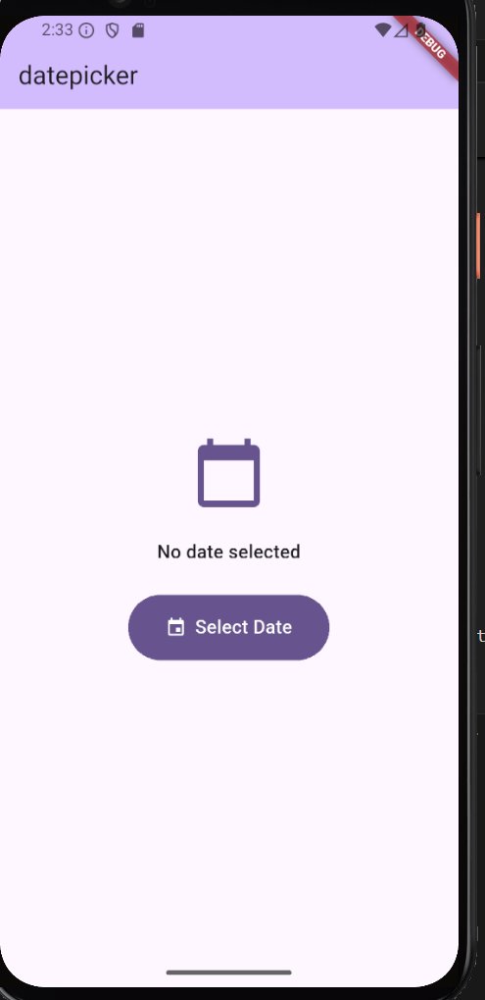
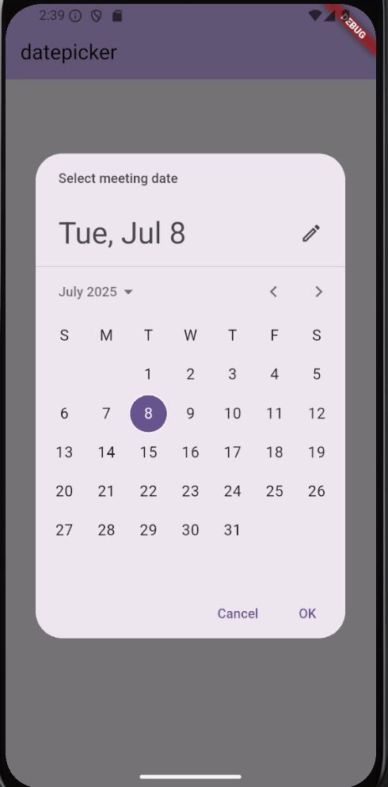

# DatePicker Widget Demo

A simple Flutter widget for selecting a date, designed for real-world use cases like booking a meeting.

## DatePicker Attributes
- **initialDate**: The date that is initially selected when the picker is shown (defaults to today or the last selected date).
- **firstDate**: The earliest date the user can select (set to 2000-01-01 in this app).
- **lastDate**: The latest date the user can select (set to 2100-12-31 in this app).
- **helpText**: The text displayed at the top of the date picker dialog (e.g., 'Select meeting date').
- **onPressed**: The callback that opens the date picker dialog when the button is pressed.
- **DateFormat**: Used to display the selected date in `dd-MM-yyyy` format.

## How to Run
1. Ensure you have [Flutter](https://flutter.dev/docs/get-started/install) installed.
2. Clone this repository:
   ```sh
   git clone https://github.com/fniyonshuti/datepicker_widget.git
   cd datepicker_widget
   ```
3. Get dependencies:
   ```sh
   flutter pub get
   ```
4. Run the app:
   ```sh
   flutter run
   ```

## Screenshots

**Home Page**



**DatePicker Dialog**



**Selectable Date Range**


---

**Widget Use Case:**
This widget is ideal for scenarios where users need to select a date, such as booking a meeting, choosing a date of birth, or scheduling an event.
